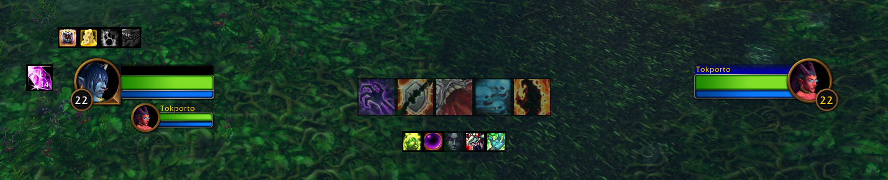

# Warlock HUD

A configurable HUD for Warlocks in **World of Warcraft: Forever beta**. It keeps
target effects, cooldowns, buffs, procs, and Soul Shards visible without opening
other panels.



## Features

| Display | What it tracks |
| --- | --- |
| Main row | Corruption, Immolate, Siphon Life, Banes, Curses, and Drain spells. Banes, Curses, and Drains each share an icon slot. Active target effects show a countdown, including milliseconds. |
| Cooldown row | Healthstone, Soulstone, Fear, and available racial abilities. |
| Buff row | Demon Armor / Demon Skin, Well Fed, Fortitude, Mark or Gift of the Wild, Intellect, Spirit, Kings, Salvation, Thorns, and Unending Breath. Active buffs show grey icons with countdowns. Thorns follows the same Druid-aware missing-buff reminder and active-buff formatting as Mark of the Wild. Unending Breath appears at the right end only while active. Visible buffs pack left to right. |
| Proc row | Power Infusion and Nightfall appear only while active, with a pulsing glow and countdown. |
| Soul Shards | A separate icon near the Player Frame shows your shard count. It flashes red at or below the low warning threshold (default 4), or yellow at or above the high threshold (default 18) or when shards occupy regular bags alongside an equipped Soul Bag. Each click destroys one shard from a regular bag, stopping when those bags are clear or your configured minimum remains. The default minimum is 8. Shards cannot be destroyed in combat. |
| Nameplates | A copper tick marks 20% health on attackable enemies' health bars. |
| Stones | A Soulstone recipient label centered below the Utility row only while the aura is confirmed active; details and a Healthstone distribution list are on the Stones settings page. |

Main row icons fade when there is no attackable target and turn red when the target
is out of range. Demon Armor / Demon Skin and Well Fed have missing-buff reminders.
The Buffs row keeps its left edge where you placed it as icons appear or disappear.
The HUD checks known spells and talents when deciding which icons to show.
On Tracked Auras, the Target DoT color toggle reverses the main row's active
and missing colors. The default is colored when active and grey when missing.

The addon can announce Ritual of Summoning, a Soulstone cast, and a completed
Healthstone trade. Soulstone announcements go to party, raid, or instance chat
when grouped. Summon and trade notices can be sent to group chat or shown only
in your own chat window.

The **General** settings page has **Demo all HUD bars**, which temporarily
overlays every icon slot at its on-screen HUD position, including disabled or
inactive buffs and procs. Each bar is labeled. Use **End HUD demo** to close it. The demo does not
change live aura tracking.

Warlock HUD runs by default on Warlocks and can be turned on or off per character
under **General**. The **Stones** page controls Soulstone status, Healthstone
distribution tracking, and optional automatic placement in an empty trade with
a current group member. You must press Accept yourself. A supplied entry means
a completed trade was recorded; it does not establish current possession.
Soulstone details appear on the Stones page only when a safe aura observation
confirms the buff is active. Countdowns may be stale during combat.
`/whub stones` lists supplied players. `/whub trace` opens a copyable debug
window with Trade and Soulstone recording buttons.

## Install

Place the files in this folder, keeping the folder name **`Warlock_Hud`** so it
matches `Warlock_Hud.toc`:

```text
World of Warcraft/_classic_beta_/Interface/AddOns/Warlock_Hud/
```

Enable **Warlock HUD** in the game's AddOns list, then enter the game or use
`/reload` after updating the files. There is no build step.

For a packaged download, use the ZIP attached to the latest GitHub Release.
It already contains the `Warlock_Hud` folder. Pushes to `main` also produce a
downloadable ZIP in the repository's Actions artifacts.

## Configure

Open the AddOns settings or type **`/whub`** (also **`/whud`**). Settings include
icon-size sliders with one-pixel step buttons, icon visibility, drag-to-reorder controls, notification choices,
Soul Shard minimum and warning thresholds, and profiles. Move each row and the Soul Shards icon in Edit
Mode; they snap to the grid. Profiles save the layout and can switch with your
active talent spec. The Profiles page validates names as you type and confirms
deletion of a profile.

Settings save as soon as they change. Layout changes update the HUD immediately
when the client allows a rebuild; otherwise the HUD updates after combat or can
be retried from the settings footer when safe.
Row and page reset actions restore the current profile's settings while keeping
its Edit Mode positions. Page resets ask for confirmation.

The addon prints its version and the settings command in chat when it loads.
For a one-time diagnostic snapshot, use `/whub debug`. It prints the active
profile, configured rows and tracked spell IDs, target/range status when safe,
and aura-tracker initialization without reading aura data.

## Development

The `.toc` file defines the addon version and Lua load order. Edit the Lua files
directly and use `/reload` in game to test changes. The game stores profiles in
`WarlockHudDB` as a SavedVariable.

### CurseForge releases

The tag workflow builds `Warlock_Hud-vX.Y.Z.zip`, publishes the GitHub Release,
then uploads that exact ZIP to CurseForge project `1727219` for Warcraft Forever
`1.60.1`. This keeps the filename and contents consistent across both sites.
The upload uses the matching file in `releases/` as its changelog, or
`CHANGELOG.md` if no release note exists.

Before publishing a new tag, create a CurseForge API token and store it in the
repository's GitHub Actions secret named `CF_API_TOKEN`. Disable the old
CurseForge packaging webhook in GitHub **Settings > Webhooks**; otherwise the
tag push can create a second CurseForge file before the workflow finishes.
Do not commit or share the token. The workflow fails visibly if the secret is
missing.

`.pkgmeta` remains available for repository packaging, but the GitHub Actions
upload uses the ZIP built by `.github/workflows/package.yml`.

To retry a release after a cancelled or failed tag run, open **Actions > Package
Warlock HUD > Run workflow** on `main` and enter the existing tag in
`release_tag`. The workflow checks out that tag, confirms its `.toc` version,
reuses an existing GitHub Release if present, and then uploads the ZIP to
CurseForge. Check CurseForge first so a retry does not create a duplicate file.

See [LICENSE](LICENSE) for the license.
